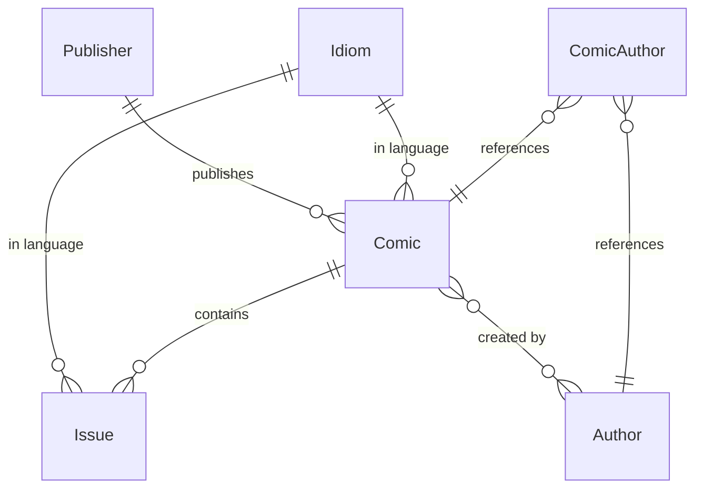

## Overview

pInk uses Supabase (PostgreSQL) as its database, providing a robust relational structure for comics, issues, authors, publishers, and languages.

## Supabase Configuration

### Database Connection

The database client is configured in `src/server/config/database.ts:16`:

```typescript database.ts
import { createClient } from "@supabase/supabase-js";

const SUPABASE_URL = process.env.SUPABASE_URL || "https://placeholder.supabase.co";
const SUPABASE_ANON_KEY = process.env.SUPABASE_ANON_KEY || "placeholder-key";

export const supabase = createClient(SUPABASE_URL, SUPABASE_ANON_KEY, {
  auth: {
    persistSession: false,
    autoRefreshToken: false,
  },
  db: {
    schema: "public",
  },
});
```

<Warning>
  Authentication is disabled (`persistSession: false`) since pInk is a public read-only catalog.
</Warning>

### Connection Testing

The server tests database connectivity on startup (src/server/config/database.ts:26):

```typescript database.ts
export async function testConnection() {
  console.log("🔍 Testing Supabase connection...");

  try {
    const { data, error, count } = await supabase
      .from("Comic")
      .select("*", { count: "exact" })
      .limit(1);

    if (error) {
      throw new Error(
        `Supabase query failed: ${error.message} (Code: ${error.code})`
      );
    }

    console.log("✅ Supabase connection SUCCESSFUL!");
    console.log(`📊 Database test: Found ${count} comics in database`);
    console.log(`🎯 Sample data:`, data[0] || "No data");

    return { success: true, count, sampleData: data };
  } catch (error: any) {
    console.error("❌ Supabase connection FAILED!");
    console.error(`💥 Error: ${error.message}`);
    throw error;
  }
}
```

## Database Schema

### Tables

<CardGroup cols={2}>
  <Card title="Comic" icon="book">
    Main comic series table
  </Card>
  <Card title="Issue" icon="file">
    Individual comic issues
  </Card>
  <Card title="Publisher" icon="building">
    Comic publishers (Marvel, DC, etc.)
  </Card>
  <Card title="Idiom" icon="language">
    Language/locale information
  </Card>
  <Card title="Author" icon="user">
    Comic authors and creators
  </Card>
  <Card title="ComicAuthor" icon="link">
    Many-to-many relationship table
  </Card>
</CardGroup>

### Comic Table

```sql
CREATE TABLE Comic (
  id SERIAL PRIMARY KEY,
  title VARCHAR NOT NULL,
  issues INTEGER,
  year INTEGER,
  cover TEXT,
  publisherId INTEGER REFERENCES Publisher(id),
  idiomId INTEGER REFERENCES Idiom(id)
);
```

**Fields:**
- `id`: Primary key
- `title`: Comic series name
- `issues`: Total number of issues
- `year`: Publication year
- `cover`: Cover image URL
- `publisherId`: Foreign key to Publisher
- `idiomId`: Foreign key to Idiom

### Issue Table

```sql
CREATE TABLE Issue (
  id SERIAL PRIMARY KEY,
  title VARCHAR NOT NULL,
  issueNumber INTEGER,
  year INTEGER,
  size VARCHAR,
  series VARCHAR,
  genres TEXT,  -- JSON array or comma-separated
  link TEXT,
  cover TEXT,
  synopsis TEXT,
  comicId INTEGER REFERENCES Comic(id),
  idiomId INTEGER REFERENCES Idiom(id),
  credito VARCHAR,
  creditoLink TEXT
);
```

**Fields:**
- `id`: Primary key
- `title`: Issue title
- `issueNumber`: Issue number in series
- `year`: Publication year
- `size`: File size (e.g., "150MB")
- `series`: Series name
- `genres`: Genre tags (JSON or CSV)
- `link`: Download link
- `cover`: Cover image URL
- `synopsis`: Issue description
- `comicId`: Foreign key to Comic
- `idiomId`: Foreign key to Idiom
- `credito`: Credit attribution
- `creditoLink`: Credit website URL

### Publisher Table

```sql
CREATE TABLE Publisher (
  id SERIAL PRIMARY KEY,
  name VARCHAR NOT NULL
);
```

Stores publisher names (Marvel, DC, Image, etc.)

### Idiom Table

```sql
CREATE TABLE Idiom (
  id SERIAL PRIMARY KEY,
  name VARCHAR NOT NULL
);
```

Stores language codes/names (Portuguese, English, etc.)

### Author Table

```sql
CREATE TABLE Author (
  id SERIAL PRIMARY KEY,
  name VARCHAR NOT NULL,
  bio TEXT,
  avatar TEXT
);
```

### ComicAuthor Junction Table

```sql
CREATE TABLE ComicAuthor (
  comicId INTEGER REFERENCES Comic(id),
  authorId INTEGER REFERENCES Author(id),
  PRIMARY KEY (comicId, authorId)
);
```

Many-to-many relationship between Comics and Authors.

## Relationships



<Tabs>
  <Tab title="Comic Relationships">
    - `Comic` → `Publisher` (Many-to-One)
    - `Comic` → `Idiom` (Many-to-One)
    - `Comic` → `Issue` (One-to-Many)
    - `Comic` ↔ `Author` (Many-to-Many via ComicAuthor)
  </Tab>
  <Tab title="Issue Relationships">
    - `Issue` → `Comic` (Many-to-One)
    - `Issue` → `Idiom` (Many-to-One)
  </Tab>
</Tabs>

## Query Patterns

### Fetch All Comics with Relations

```typescript
const { data, error } = await supabase
  .from("Comic")
  .select(`
    id, 
    title, 
    issues, 
    year, 
    cover, 
    Idiom(name),
    Publisher(name)
  `)
  .order("title", { ascending: true })
  .order("year", { ascending: true });
```

### Fetch Comic with Authors

```typescript
// Get comic
const { data: comic } = await supabase
  .from("Comic")
  .select(`*, Idiom(name), Publisher(name)`)
  .eq("id", comicId)
  .single();

// Get authors via junction table
const { data: authorsData } = await supabase
  .from("ComicAuthor")
  .select("Author(*)")
  .eq("comicId", comicId);

const authors = authorsData?.map((ca) => ca.Author) || [];
```

### Fetch Issues for Comic

```typescript
const { data, error } = await supabase
  .from("Issue")
  .select("*, Idiom(name)")
  .eq("comicId", comicId)
  .order("issueNumber", { ascending: true });
```

### Fetch Issue with Full Details

```typescript
const { data, error } = await supabase
  .from("Issue")
  .select("*, Idiom(name), Comic(*, Publisher(name))")
  .eq("id", issueId)
  .single();
```

### Search Issues

```typescript
const { data, error } = await supabase
  .from("Issue")
  .select("*, Idiom(name), Comic(title)", { count: "exact" })
  .ilike("title", `%${searchTerm}%`)
  .order("issueNumber", { ascending: true })
  .range(offset, offset + limit - 1);
```

## Data Transformation

### Genres Parsing

Genres can be stored as JSON or CSV and need parsing (src/server/controllers/issuesController.ts:27):

```typescript
let genres = data.genres;
if (typeof genres === "string") {
  try {
    genres = JSON.parse(genres);
  } catch (e) {
    genres = genres.split(",").map((g: string) => g.trim());
  }
}
```

### Response Mapping

Database responses are transformed to API format:

```typescript
const comics = (data as any[]).map((comic) => ({
  id: comic.id,
  title: comic.title,
  total_issues: comic.issues,  // Rename field
  year: comic.year,
  cover: comic.cover,
  language: comic.Idiom?.name || null,  // Flatten relation
  publisher: comic.Publisher?.name || null,  // Flatten relation
}));
```

## Indexing Strategy

<AccordionGroup>
  <Accordion title="Primary Keys">
    All tables have auto-incrementing `id` primary keys
  </Accordion>
  <Accordion title="Foreign Keys">
    `publisherId`, `idiomId`, `comicId` should be indexed for join performance
  </Accordion>
  <Accordion title="Search Fields">
    `title` fields should have GIN indexes for full-text search:
    ```sql
    CREATE INDEX comic_title_idx ON Comic USING GIN (to_tsvector('portuguese', title));
    CREATE INDEX issue_title_idx ON Issue USING GIN (to_tsvector('portuguese', title));
    ```
  </Accordion>
  <Accordion title="Sort Fields">
    `year` and `issueNumber` should be indexed for ORDER BY performance
  </Accordion>
</AccordionGroup>

## Supabase Features Used

<CardGroup cols={2}>
  <Card title="Auto-generated API" icon="bolt">
    PostgREST automatically generates REST endpoints
  </Card>
  <Card title="Relation Expansion" icon="arrows-split-up-and-left">
    Nested `select()` queries join related tables
  </Card>
  <Card title="Row Counting" icon="hashtag">
    `{ count: 'exact' }` option returns total count
  </Card>
  <Card title="Pagination" icon="list-ol">
    `.range(from, to)` for efficient pagination
  </Card>
</CardGroup>

## Error Codes

| Code | Meaning |
|------|----------|
| `PGRST116` | No rows returned (404) |
| `23505` | Unique constraint violation |
| `23503` | Foreign key violation |
| `42P01` | Table does not exist |

## Security

<Warning>
  Supabase Row Level Security (RLS) policies should be configured to:
  - Allow public read access to all tables
  - Restrict write/delete operations
  - Protect sensitive data if any
</Warning>

Example RLS policy for read-only access:

```sql
ALTER TABLE Comic ENABLE ROW LEVEL SECURITY;

CREATE POLICY "Allow public read access"
ON Comic
FOR SELECT
TO anon
USING (true);
```

<Note>
  The `anon` role is used by the Supabase anonymous key for unauthenticated access.
</Note>