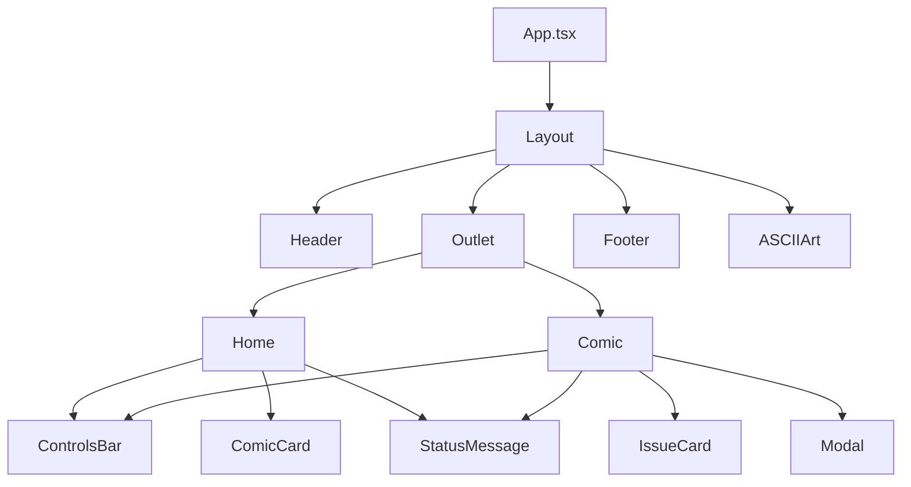
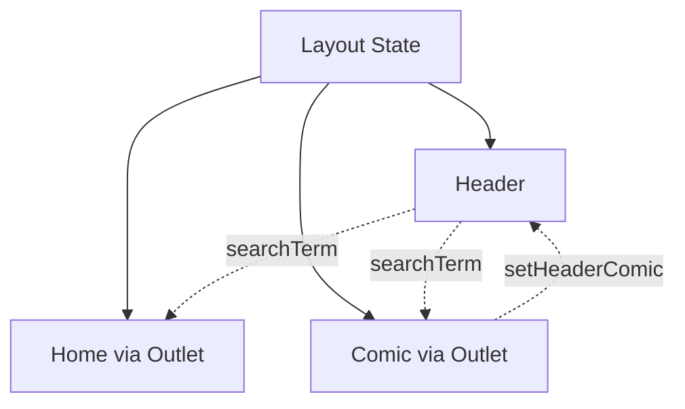

## Overview

The pInk frontend is built with React 19, TypeScript, and Vite 7, providing a fast and modern user experience.

## Build Setup

### Vite Configuration

The project uses Vite for:
- Fast development server with HMR (Hot Module Replacement)
- Optimized production builds
- React plugin for JSX transformation

```json package.json
{
  "scripts": {
    "dev": "vite",
    "build": "vite build",
    "preview": "vite preview"
  },
  "devDependencies": {
    "vite": "^7.1.2",
    "@vitejs/plugin-react": "^5.1.2"
  }
}
```

## Component Architecture

### Component Hierarchy



### Core Components

<CardGroup cols={2}>
  <Card title="Pages" icon="file">
    - `Home.tsx` - Comic catalog listing
    - `Comic.tsx` - Comic detail with issues
  </Card>
  <Card title="Layout" icon="layout">
    - `Header.tsx` - Top navigation and search
    - `Footer.tsx` - Site footer
    - `ControlsBar.tsx` - Filters and view controls
  </Card>
  <Card title="Cards" icon="square">
    - `ComicCard.tsx` - Comic grid item
    - `IssueCard.tsx` - Issue grid item
  </Card>
  <Card title="UI Components" icon="window">
    - `Modal.tsx` - Issue details modal
    - `StatusMessage.tsx` - Loading/error states
    - `SEOHead.tsx` - Meta tag management
  </Card>
</CardGroup>

## Routing

### React Router Setup

The app uses React Router DOM 7 for client-side routing (src/App.tsx:38):

```tsx App.tsx
const App: React.FC = () => {
  return (
    <Routes>
      <Route path="/" element={<Layout />}>
        <Route index element={<Home />} />
        <Route path=":slug" element={<ComicPage />} />
      </Route>
    </Routes>
  );
};
```

### Layout Component

The `Layout` component provides shared context to child routes (src/App.tsx:10):

```tsx App.tsx
const Layout: React.FC = () => {
  const [searchTerm, setSearchTerm] = useState("");
  const [headerComic, setHeaderComic] = useState<any | null>(null);
  const location = useLocation();
  const navigate = useNavigate();

  const isHome = location.pathname === "/" || 
                 location.pathname === "" || 
                 location.pathname === "/index.html";
  const view = isHome ? "home" : "issues";

  return (
    <div className="main-wrapper">
      <div className="landing-section">
        <Header
          view={view}
          currentComic={headerComic}
          searchTerm={searchTerm}
          onSearchChange={setSearchTerm}
        />
        <Outlet context={{ searchTerm, setHeaderComic }} />
      </div>
      <Footer />
      <ASCIIArt />
    </div>
  );
};
```

### Outlet Context

Child routes access shared state via `useOutletContext`:

```tsx Home.tsx
interface HomeContext {
  searchTerm: string;
}

const Home: React.FC = () => {
  const { searchTerm } = useOutletContext<HomeContext>();
  // ...
};
```

```tsx Comic.tsx
interface ComicContext {
  searchTerm: string;
  setHeaderComic: (comic: ComicType | null) => void;
}

const ComicPage: React.FC = () => {
  const { searchTerm, setHeaderComic } = useOutletContext<ComicContext>();
  // ...
};
```

## State Management

### Local Component State

pInk uses React hooks for state management without external libraries:

<Tabs>
  <Tab title="useState">
    Local state for UI and data
    ```tsx
    const [allComics, setAllComics] = useState<Comic[]>([]);
    const [isLoading, setIsLoading] = useState(true);
    const [error, setError] = useState<string | null>(null);
    const [viewMode, setViewMode] = useState<"grid" | "list">("grid");
    ```
  </Tab>
  <Tab title="useEffect">
    Side effects for data loading
    ```tsx
    useEffect(() => {
      const loadComics = async () => {
        setIsLoading(true);
        try {
          const response = await api.getAllComics();
          setAllComics(response.data);
        } catch (error) {
          setError("Erro ao carregar dados");
        } finally {
          setIsLoading(false);
        }
      };
      loadComics();
    }, []);
    ```
  </Tab>
  <Tab title="useMemo">
    Memoized computed values
    ```tsx
    const filteredItems = useMemo(() => {
      return allComics.filter((item) =>
        item.title.toLowerCase().includes(searchTerm.toLowerCase())
      );
    }, [allComics, searchTerm]);
    ```
  </Tab>
  <Tab title="useRef">
    DOM references and mutable values
    ```tsx
    const lastScrollTop = useRef(0);
    const scrollableContentRef = useRef<HTMLDivElement>(null);
    ```
  </Tab>
</Tabs>

### State Lifting

Shared state is lifted to the `Layout` component and passed down:



## API Client

### Frontend API Layer

The `src/api.ts` file provides a typed API client:

```typescript api.ts
export interface Comic {
  id: number;
  title: string;
  total_issues: number;
  year: number;
  cover: string;
  language: string;
  publisher: string;
  authors?: any[];
}

export interface Issue {
  id: number;
  title: string;
  issueNumber: number;
  year: number;
  size: string;
  series: string;
  genres: string | string[];
  link: string;
  cover: string;
  synopsis: string;
  language: string;
  // ...
}

export interface ApiResponse<T> {
  success: boolean;
  data: T;
  count?: number;
  total?: number;
}

const API_BASE_URL = "";

export const api = {
  async getAllComics(): Promise<ApiResponse<Comic[]>> {
    const response = await fetch(`${API_BASE_URL}/api/comics`);
    if (!response.ok) throw new Error("Falha ao carregar quadrinhos");
    return (await response.json()) as ApiResponse<Comic[]>;
  },

  async getComicById(id: number | string): Promise<ApiResponse<Comic>> {
    const response = await fetch(`${API_BASE_URL}/api/comics/${id}`);
    if (!response.ok) throw new Error("Falha ao carregar detalhes");
    return (await response.json()) as ApiResponse<Comic>;
  },

  async getComicIssues(id: number | string): Promise<ApiResponse<Issue[]>> {
    const response = await fetch(`${API_BASE_URL}/api/comics/${id}/issues`);
    if (!response.ok) throw new Error("Falha ao carregar edições");
    return (await response.json()) as ApiResponse<Issue[]>;
  },

  async getIssueById(id: number | string): Promise<ApiResponse<Issue>> {
    const response = await fetch(`${API_BASE_URL}/api/issues/${id}`);
    if (!response.ok) throw new Error("Falha ao carregar detalhes");
    return (await response.json()) as ApiResponse<Issue>;
  },
};
```

<Note>
  The `API_BASE_URL` is empty string, allowing the API to be served from the same origin (important for Vercel deployment).
</Note>

## SEO Management

### React Helmet Async

SEO is handled via the `updateMetaTags` utility (src/utils/seoUtils.ts:11):

```typescript seoUtils.ts
interface SEOData {
  title: string;
  description: string;
  image?: string;
  url?: string;
  keywords?: string;
}

export const updateMetaTags = ({
  title,
  description,
  image,
  url,
  keywords,
}: SEOData) => {
  document.title = title;

  const metadata = {
    'meta[name="title"]': title,
    'meta[name="description"]': description,
    'meta[name="keywords"]': keywords || "quadrinhos, hqs, comics",
    'meta[property="og:title"]': title,
    'meta[property="og:description"]': description,
    'meta[property="og:image"]': image || DEFAULT_OG_IMAGE,
    'meta[property="og:url"]': url || window.location.href,
    'meta[name="twitter:card"]': "summary_large_image",
    'meta[name="twitter:title"]': title,
    'meta[name="twitter:description"]': description,
    'meta[name="twitter:image"]': image || DEFAULT_OG_IMAGE,
  };

  // Update or create meta tags
  Object.entries(metadata).forEach(([selector, content]) => {
    const element = document.querySelector(selector);
    if (element) {
      element.setAttribute("content", content);
    } else {
      const meta = document.createElement("meta");
      // ... create new meta tag
    }
  });
};
```

### Dynamic Meta Tags

Each page updates meta tags on mount:

```tsx Home.tsx
useEffect(() => {
  updateMetaTags({
    title: "pInk | Catálogo de Quadrinhos Gratuitos",
    description: "Explore o pInk, o melhor catálogo de quadrinhos...",
    keywords: "catálogo de quadrinhos, hqs gratuitas, ...",
  });
}, []);
```

## Styling

### CSS Architecture

Styles are imported globally in `App.tsx:8`:

```tsx
import "./styles/main.css";
```

The application uses:
- Custom CSS with BEM-like naming
- CSS variables for theming
- Responsive design with media queries
- Smooth transitions and animations

## Performance Patterns

<AccordionGroup>
  <Accordion title="Memoization">
    `useMemo` prevents unnecessary recalculations of filtered data
  </Accordion>
  <Accordion title="Debounced Scrolling">
    Scroll event handlers use refs to avoid excessive state updates
  </Accordion>
  <Accordion title="Lazy Loading">
    Images load on-demand with fallback placeholders
  </Accordion>
  <Accordion title="Event Cleanup">
    All event listeners are properly removed on unmount
  </Accordion>
  <Accordion title="Parallel Requests">
    `Promise.all` loads comic and issues data simultaneously
  </Accordion>
</AccordionGroup>

## TypeScript Integration

### Type Safety

All components and props are fully typed:

```typescript
interface ComicCardProps {
  comic: Comic;
}

const ComicCard: React.FC<ComicCardProps> = ({ comic }) => {
  // ...
};
```

### Type Imports

Types are imported from the API client:

```typescript
import { api, Comic, Issue } from "../api";
```

<Info>
  The frontend maintains its own type definitions separate from the backend server types, allowing for different API response formats.
</Info>