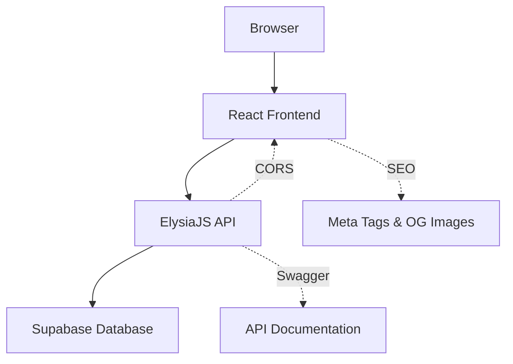
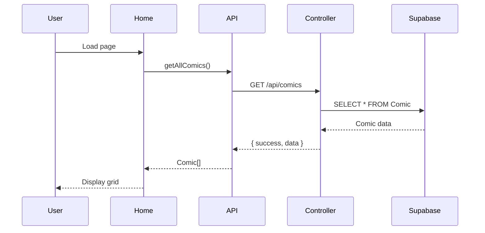
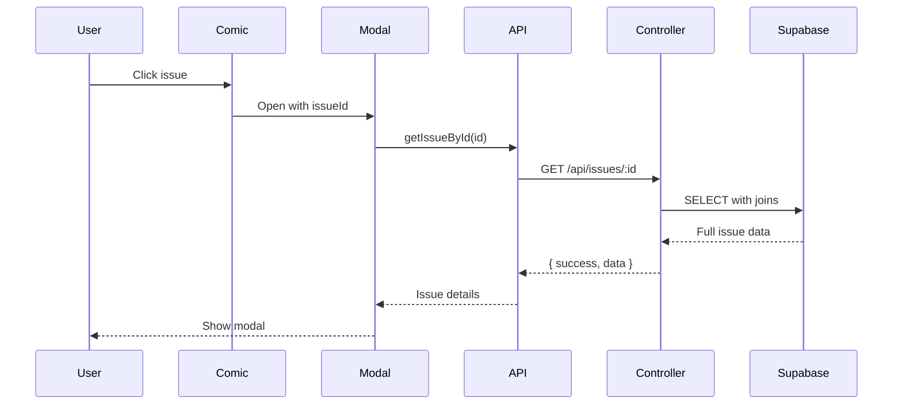

## Architecture Overview

pInk is built as a modern full-stack web application with a clear separation between frontend, backend, and database layers.

## System Layers



<CardGroup cols={3}>
  <Card title="Frontend" icon="browser">
    React + Vite with TypeScript
  </Card>
  <Card title="Backend" icon="server">
    Bun + ElysiaJS REST API
  </Card>
  <Card title="Database" icon="database">
    Supabase (PostgreSQL)
  </Card>
</CardGroup>

## Technology Stack

### Frontend

| Technology | Purpose |
|------------|----------|
| **React 19** | UI framework |
| **Vite 7** | Build tool and dev server |
| **TypeScript** | Type safety |
| **React Router DOM 7** | Client-side routing |
| **React Helmet Async** | SEO meta tag management |

### Backend

| Technology | Purpose |
|------------|----------|
| **Bun** | JavaScript runtime |
| **ElysiaJS 1.4** | Web framework |
| **@elysiajs/cors** | CORS handling |
| **@elysiajs/swagger** | API documentation |
| **@supabase/supabase-js** | Database client |

### Database

| Technology | Purpose |
|------------|----------|
| **Supabase** | Backend-as-a-service |
| **PostgreSQL** | Relational database |

## Request Flow

<Steps>
  <Step title="Client Request">
    User interacts with React frontend (browse, search, filter)
  </Step>
  <Step title="API Call">
    Frontend makes HTTP request to ElysiaJS backend at `/api/*`
  </Step>
  <Step title="Controller Logic">
    Backend controller processes request and queries Supabase
  </Step>
  <Step title="Database Query">
    Supabase executes PostgreSQL query on Comic/Issue tables
  </Step>
  <Step title="Response Transform">
    Backend transforms database response to API format
  </Step>
  <Step title="UI Update">
    Frontend receives data and updates React components
  </Step>
</Steps>

## Project Structure

```
pink/
├── src/
│   ├── components/        # React components
│   │   ├── ComicCard.tsx
│   │   ├── IssueCard.tsx
│   │   ├── ControlsBar.tsx
│   │   ├── Modal.tsx
│   │   ├── Header.tsx
│   │   └── ...
│   ├── pages/            # Page components
│   │   ├── Home.tsx
│   │   └── Comic.tsx
│   ├── server/           # Backend code
│   │   ├── index.ts
│   │   ├── controllers/
│   │   └── config/
│   ├── utils/            # Utility functions
│   ├── api.ts            # Frontend API client
│   ├── App.tsx           # Root component
│   └── main.tsx          # Entry point
├── api/
│   └── index.ts          # Vercel serverless entry
├── package.json
└── vercel.json           # Deployment config
```

## Data Flow

### Comic Browsing Flow



### Issue Detail Flow



## Environment Variables

<AccordionGroup>
  <Accordion title="SUPABASE_URL">
    Supabase project URL
    ```bash
    SUPABASE_URL=https://your-project.supabase.co
    ```
  </Accordion>
  <Accordion title="SUPABASE_ANON_KEY">
    Supabase anonymous API key
    ```bash
    SUPABASE_ANON_KEY=your-anon-key
    ```
  </Accordion>
  <Accordion title="PORT">
    Server port (optional, defaults to 3000)
    ```bash
    PORT=3000
    ```
  </Accordion>
  <Accordion title="NODE_ENV">
    Environment mode (development/production)
    ```bash
    NODE_ENV=production
    ```
  </Accordion>
</AccordionGroup>

## Deployment Architecture

### Vercel Deployment

The application is deployed on Vercel with:

- **Frontend**: Static React build served via Vercel CDN
- **Backend**: Serverless function at `/api`
- **Routing**: All routes handled by React Router

```json vercel.json
{
  "rewrites": [
    { "source": "/api/(.*)", "destination": "/api" },
    { "source": "/(.*)", "destination": "/" }
  ]
}
```

## Performance Optimizations

<CardGroup cols={2}>
  <Card title="React Memoization" icon="bolt">
    `useMemo` for expensive filtering operations
  </Card>
  <Card title="Parallel Loading" icon="arrows-split-up-and-left">
    `Promise.all` for simultaneous API calls
  </Card>
  <Card title="Image Optimization" icon="image">
    Lazy loading with fallback placeholders
  </Card>
  <Card title="Auto-hide Controls" icon="eye-slash">
    Scroll-based UI hiding for immersive browsing
  </Card>
</CardGroup>

## Error Handling

<Steps>
  <Step title="API Level">
    ElysiaJS `onError` handler catches all server errors
  </Step>
  <Step title="Controller Level">
    Try-catch blocks in controllers with custom error messages
  </Step>
  <Step title="Client Level">
    React error states with retry functionality
  </Step>
  <Step title="UI Level">
    StatusMessage component displays user-friendly errors
  </Step>
</Steps>

## Security Features

<Warning>
  The Supabase anonymous key is used for read-only access. Row-level security policies should be configured in Supabase.
</Warning>

- **CORS Configuration**: Properly configured CORS for cross-origin requests
- **No Auth Persistence**: Auth disabled for public catalog access
- **Input Sanitization**: Search and filter inputs sanitized
- **External Links**: `rel="noreferrer"` on external links

<Note>
  The system is designed for public read-only access to the comic catalog. Write operations would require authentication.
</Note>